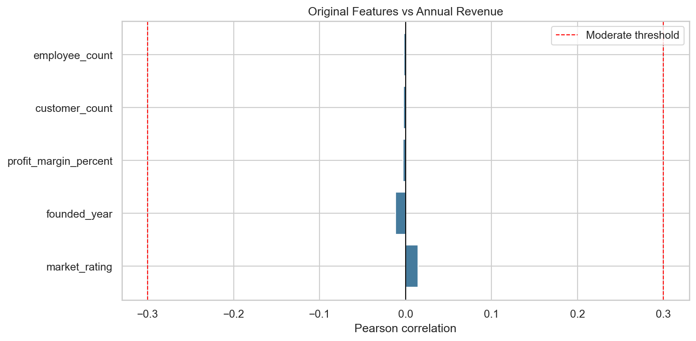
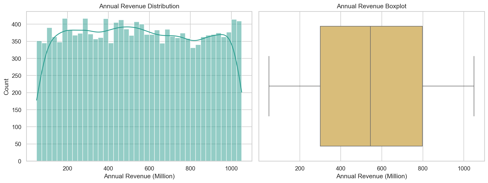
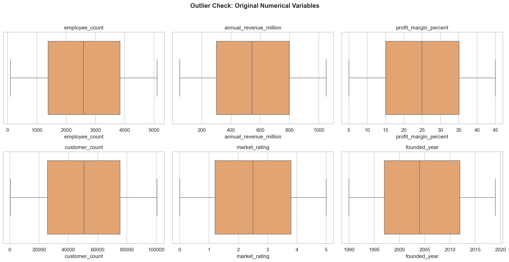
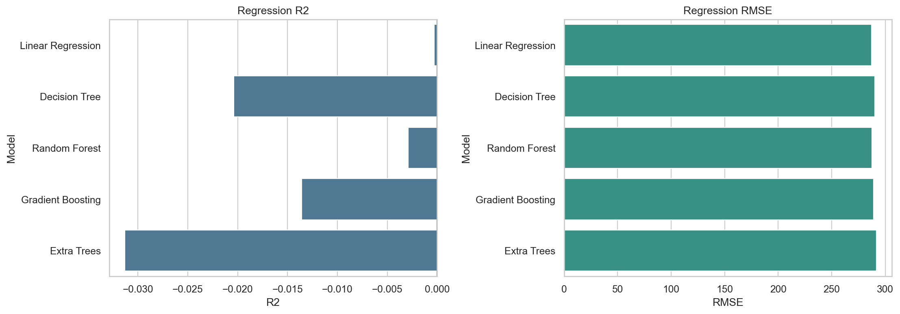

# Exploratory Data Analysis and Revenue Forecasting on Industry Data

This project combines Exploratory Data Analysis (EDA) and Machine Learning to understand company performance patterns and evaluate the feasibility of predicting annual revenue using business-related features.

The main target variable is:

```text
annual_revenue_million
```

## Dataset

The dataset contains 15,000 company records. It includes company size, industry, country, region, employee count, customer count, annual revenue, profit margin, market rating, founding year, and creation date.

## Project Workflow

1. Import libraries.
2. Load the dataset.
3. Inspect the first rows, columns, shape, data types, and dataset information.
4. Check missing values and duplicate rows.
5. Review descriptive statistics such as mean, standard deviation, minimum, maximum, and percentiles.
6. Check skewness and kurtosis.
7. Analyze the target variable.
8. Check correlation with the target before feature engineering.
9. Build useful features from the available columns.
10. Perform univariate analysis.
11. Detect outliers using IQR and Z-score methods.
12. Perform bivariate analysis.
13. Perform multivariate analysis.
14. Extract business insights and recommendations.
15. Train supervised machine learning models.
16. Explain why the model performance is weak without data leakage.

## Important Finding

The original numerical features have very weak correlation with annual revenue.



Most original variables show correlations close to zero with annual revenue, indicating very weak predictive relationships. This means the available original variables do not explain annual revenue well.

This is important because the project PDF suggests stronger relationships, but the actual dataset does not support that claim. The analysis follows the dataset, not the assumption from the PDF.

## Target Variable

Annual revenue is spread across a wide range, from about 50 million to about 1,050 million.



The revenue distribution is almost symmetric. It does not need a log transformation.

## Outlier Detection

Outliers were checked using both IQR and Z-score methods.



Both methods showed zero outliers in the original numerical variables. Because of this, no outlier treatment was required.

## Feature Engineering

The project creates useful features such as:

- `company_age`
- `created_month`
- `created_quarter`
- `created_year`
- `customer_per_employee`
- `profit_score`
- `company_size`
- `customer_size`
- `revenue_tier`
- `high_performer`

Some features are useful for EDA but must not be used for revenue prediction because they are calculated from revenue.

These excluded leakage features are:

- `revenue_per_employee`
- `revenue_per_customer`
- `profit_million`
- `profit_per_employee`

Using these features in the model would give an unrealistically high score because they already contain information from the target variable.

## Machine Learning

The model uses only non-leaky features such as employee count, customer count, profit margin, market rating, company age, date features, and encoded categorical columns.

The tested models include:

- Linear Regression
- Decision Tree
- Random Forest
- Gradient Boosting
- Extra Trees

The poor performance was consistent across all models, suggesting that the limitation comes from the available features rather than the choice of algorithm.



The best model was Linear Regression, but the R2 score was still close to zero:

```text
Best model: Linear Regression
R2 score: -0.0003
```

This result is weak, but it is honest. The model is weak because the available independent features have almost no relationship with annual revenue.

## Final Conclusion

The project shows that annual revenue cannot be predicted accurately using the current dataset without data leakage.

High scores can be produced only by using revenue-derived features, but that would be incorrect. A good revenue forecasting model would need stronger real business predictors such as sales volume, product pricing, marketing spend, customer lifetime value, operational cost, market share, and product category.

The project demonstrates the importance of feature quality in machine learning, as model performance depends more on the relevance of the available data than on the complexity of the algorithm.

## Files

- `EDA and Revenue Forecasting on Industry Data.ipynb`: main analysis notebook
- `README.md`: project summary
- `EDA and Revenue Forecasting on Industry Data.pptx`: presentation file
---

### Author

Manisha Nagda
